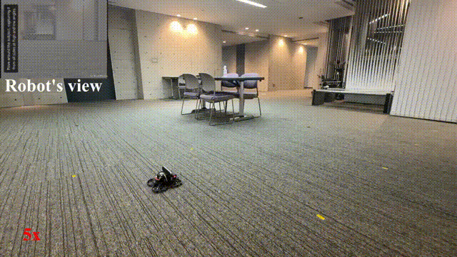
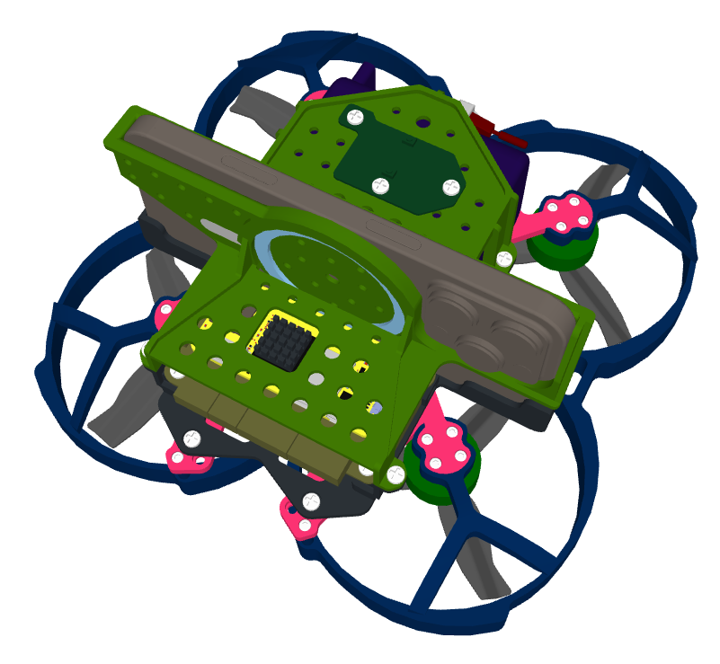
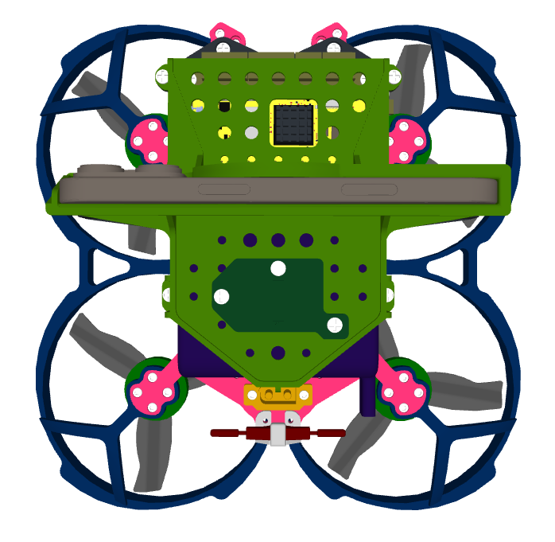
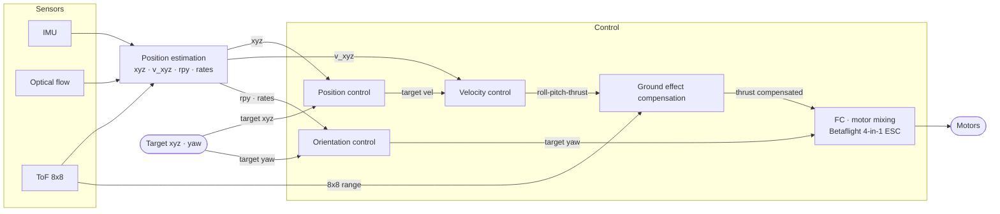

# Autonomous Drone

<p align="center">
  
</p>

Compact autonomous quadcopter built around a Raspberry Pi Zero 2 W. It estimates its position from an IMU, optical flow, and an altitude ToF sensor, then closes the loop on position and velocity onboard — no external positioning system required.

## Hardware

| | |
|---|---|
| Dimensions | 205 (L) × 205 (W) × 110 (H) mm |
| Weight | 877 g |
| Battery | Li-ion 6S pack (~5 min flight time) |
| Onboard controller | Raspberry Pi Zero 2 W |
| Sensors | IMU · optical flow · altitude ToF · A/D converter |
| Flight controller | 4-in-1 ESC (Betaflight) |

<p align="center">
  
  
</p>

## Repository layout

```
├── cad/Assembly.step    # robot CAD design
├── imgs/                # demo.gif · iso.png · top.png
├── includes/            # include files
├── log/                 # binary flight logs (*.bin)
├── src/                 # source files
├── main.cpp             # main code
├── Makefile
└── plot_log_bin.py      # plot flight logs with Python
```

## Build

From the repository root:

```bash
make clean && make
```

## Software design

```
┌────────────────────────────────────────────────┐
│ Application — C++ (threads 0 / 1 / 2)          │
├────────────────────────────────────────────────┤
│ OS — Raspbian 12 Bookworm (32-bit)             │
├────────────────────────────────────────────────┤
│ Hardware — sensors · Pi Zero 2 W · 4-in-1 ESC  │
└────────────────────────────────────────────────┘
```

All threads run simultaneously:

- **Thread 0** — position control (100 Hz), CRFS communication (100 Hz)
- **Thread 1** — sensor readings (IMU 100 Hz, A/D conv 100 Hz, optical flow 10 Hz), position estimation (10 Hz), data logging (100 Hz)
- **Thread 2** — ToF reading (15 Hz), supervisor at 15 Hz (internal monitoring & management of flight and emergency states)

## Control design



| Module | In | Out | Feedback |
|---|---|---|---|
| Position control | target xyz | target velocity | current xyz |
| Velocity control | target velocity | roll-pitch-thrust | current velocity |
| Orientation control | target yaw | target yaw | yaw, yaw rate |
| Position estimation | ToF 8×8, IMU, optical flow | xyz, v_xyz, rpy, rates | — |
| Ground effect | ToF 8×8 | thrust compensation | — |
| FC | roll-pitch-yaw-thrust | motor mixing | — |

## Flight stages

| Stage | Code |
|---|---|
| Landed | 0 |
| Takeoff | 1 |
| Hover | 2 |
| Move | 3 |
| Landing | 4 |

## Emergency stages

**Emergency landing**

| Condition | Code |
|---|---|
| Battery ≤ 20 V | -1 |
| Altitude > 1.65 m | -2 |
| Sensor frequency < 50% of nominal | -3 |

**Emergency stop**

| Condition | Code |
|---|---|
| Linear velocity > ±0.65 m/s | -11 |
| Roll-pitch angle > ±25° | -12 |
| Sensor frequency = 0 Hz | -13 |
| Altitude > 1.95 m | -14 |
| Button | -15 |
| Angular velocity > ±180 °/s | -16 |

## Flight data

All flight data are stored in binary log files (`log/*.bin`). Plot them with:

```bash
python plot_log_bin.py [logfilename].bin
```

## License

Released under the [MIT License](LICENSE) — applies to the code, CAD, and documentation.
